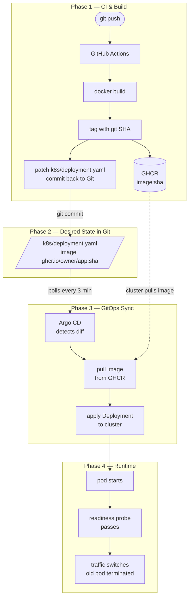
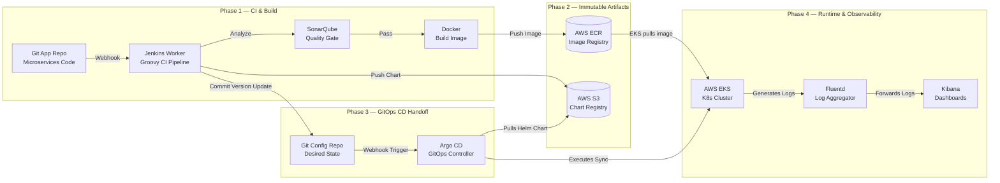

# GitOps local deployment with Argo CD / Kind

Deployment workflow using Argo CD, Kind, and GitHub Actions.

## Architecture



The above is a simplified version of a production architecture that would use
Jenkins, SonarQube, ECR, EKS, and an ELK + Prometheus monitoring stack with
alerting via Alertmanager and Argo CD notifications.

### Production Architecture



## Prerequisites

Tools required:

Docker >= 24.x - https://docs.docker.com/get-docker/ <br>
Kind 0.23.0 - https://kind.sigs.k8s.io/<br>
kubectl 1.30.x - https://kubernetes.io/docs/tasks/tools/<br>
Helm 3.15.x - https://helm.sh/docs/intro/install/<br>
argocd CLI 2.11.x - https://argo-cd.readthedocs.io/<br>

GitHub requirements:

Repository must be public so Argo CD can pull manifests without credentials.

A classic Personal Access Token is required with the following scopes: `repo`,
`write:packages`, `read:packages`, `workflow`. 
## Quickstart

### 1. Clone the repository

```bash
git clone https://github.com/sync0n/sre-gitops-argocd.git
cd sre-gitops-argocd
```

### 2. Set credentials

```bash
export GITHUB_USER=your-github-username
export GITHUB_TOKEN=your-github-pat
```

### 3. Bootstrap

```bash
make setup
```

Creates the Kind cluster, installs Argo CD, applies RBAC, creates the image pull
secret, patches the repo URL into the Argo CD Application, and applies it.
No manual steps required after this. Re-running `make setup` is safe.

The image is already published to GHCR from the CI pipeline runs visible in the
Actions tab. Running `make setup` will deploy the version referenced in
`k8s/deployment.yaml` immediately without needing to trigger a new build.

### 4. Verify

```bash
kubectl get pods -n app
make app-forward
# in another terminal:
curl http://localhost:8888/health
# {"status": "ok", "version": "a3f2c1d"}
```

### 5. Argo CD UI (if needed)

```bash
make argocd-ui
# http://localhost:8080 - credentials printed by make setup
```

### 6. Tear down

```bash
make clean
```

## Update trigger

If you have write access to the repository, push any change to trigger the full
CI pipeline:

```bash
git commit -am "feat: example change"
git push origin main
```

GitHub Actions builds the image, tags it with the git SHA, patches
`k8s/deployment.yaml`, commits it back. Argo CD detects the commit and syncs.

```bash
kubectl get pods -n app -w
argocd app get app
argocd app history app
```

## Implementation Choices

The assignment required choosing 2 items from Part 4 (reliability) and 1 from
Part 5 (security/observability).

Part 4 - health checks and resource limits were chosen. The readiness probe gates
traffic until the pod is healthy, enabling zero-downtime rollouts. The liveness
probe restarts pods that become unresponsive. Resource limits prevent a
misbehaving pod from starving other workloads on the node.

Rollback is also documented below as it comes for free with the GitOps model,
no additional implementation needed.

Part 5 - RBAC was chosen because it was already required by Part 1 (Argo CD
access must be secured), so implementing it properly satisfies both requirements
at once.

Two roles are defined in `argocd/rbac-config.yaml`. The readonly role can view
apps and history but cannot trigger syncs or delete anything. The deployer role
can view and sync but cannot delete. Admin access is used only during bootstrap.

This RBAC operates at the Argo CD level, controlling who can manage deployments
through Argo CD's interface and API. This is separate from Kubernetes RBAC which
controls direct cluster access via kubectl. Two different layers, two different
concerns.

In production these roles would be mapped to SSO groups, so developers
get readonly access and ops teams get deployer access based on organisation
membership, with no manual user management needed.

## Reliability and Security Considerations

Every deployment goes through the readiness probe before receiving traffic. If a
bad image is pushed the pod never becomes ready, the old pod stays live, and the
deployment stalls rather than causing downtime. The liveness probe handles the
case where a pod becomes unresponsive after a successful start.

Rollback is deterministic, every deployed version is a git SHA. To roll
back, revert the commit and push, Argo CD handles the rest of the logic. In an emergency the
Argo CD CLI can roll back directly:

```bash
argocd app history app
argocd app rollback app <id>
```

Rolling back via CLI temporarily diverges the cluster from Git state. A
subsequent push will override it, so this should only be used when speed matters
more than process.

No secrets are committed to Git. The GHCR pull secret is injected by
bootstrap.sh using credentials from environment variables:

```bash
kubectl create secret docker-registry ghcr-secret \
  --docker-server=ghcr.io \
  --docker-username=$GITHUB_USER \
  --docker-password=$GITHUB_TOKEN \
  -n app
```

In production this would be replaced with Sealed Secrets (encrypt client-side,
safe to commit to Git) or External Secrets Operator (sync from AWS Parameter
Store or Secret Manager).

For a private repository, add credentials to Argo CD after bootstrap:

```bash
argocd repo add https://github.com/your-org/your-repo.git \
  --username your-username \
  --password your-github-token
```

## Assumptions and Tradeoffs

The evaluator is expected to clone the repository and run `make setup` to verify
reproducibility. The full CI pipeline is demonstrated through the Actions tab
history rather than requiring the evaluator to trigger a new build. This assumes
a public repo and public GHCR image which are already in place.

Kind over managed Kubernetes - reproducible, zero cost, no cloud credentials
needed. EKS would require Terraform, IAM, and a cloud account, all out of scope
for local reproducibility.

Flat YAML over Helm - single environment, one service. Helm adds complexity
without benefit here. The natural next step when this scales to multiple
environments or services.

GitHub Actions over Jenkins - native to the repo, zero infrastructure to manage.
Jenkins is the right tool for enterprise CI with shared libraries and on-prem
runners.

GHCR over ECR - no AWS account required, no rate limits. ECR is the correct
choice in a production AWS environment.

Auto-sync enabled - fine for a single dev environment. Production would use manual
sync with a PR-based approval workflow between environments.

Polling over webhooks - simpler setup, no inbound network requirements for a local
cluster. Webhooks reduce sync latency to seconds and are the production default.

No Terraform - adds no value for a local Kind cluster. The right tool for
provisioning EKS, VPCs, IAM roles, and DNS.

Public repo and image - simplest approach for local reproducibility. A private
setup requires `argocd repo add` for repo credentials and a valid imagePullSecret
for GHCR, both documented in the Security section above.

App and deployment config in the same repository - fine at this scale. In
production these would be split into separate repositories to decouple release
cadence from deployment config and avoid CI commit loops.

## What I Would Improve With More Time

Infrastructure - Terraform for EKS provisioning (node groups, VPC, IAM/IRSA) and
a separate config repository to decouple app and infra changes and eliminate CI
commit loops.

Delivery - Argo Rollouts for canary deployments with automated analysis, and
environment overlays (dev/staging/prod) with PR-based promotion gates.

Observability - Prometheus scraping a `/metrics` endpoint with Grafana dashboards,
Argo CD Slack notifications on sync failure, and centralised logging via ELK stack.

Security - Sealed Secrets or External Secrets Operator for GitOps-compatible
secret management, Trivy image scanning in CI.

## Version Pins

- Kubernetes            1.30.3
- Kind                  0.23.0
- Argo CD               2.11.3
- Argo CD Helm Chart    7.3.4
- Python (App)          3.12
- Flask                 3.0.3
